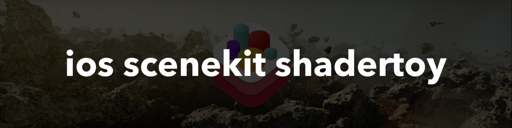

# ios-scenekit-shadertoy 

**Last Update: 27/April/2019.**

### If you like the project, please give it a star ⭐ It will show the creator your appreciation and help others to discover the repo.

# ✍️ About 
Easily add, changed and combine `Vertex` and `Fragment` shaders for `SceneKit` objects. Implement multipass rendering techniques using `SceneKit` framework. Perfect tool for prototyping  shaders in the context of SceneKit framework. 🎮

The app is constantly evolving by improving `UI`, adding new `shaders` and capabilities.

# 📺 Demo

# 🗺 Development Roadmap

The following list is the minimal `ToDo` roadmap for the project:

- [ ] Ability to switch between the built-in saders (thanks to [Create The Imaginable](https://github.com/CreateTheImaginable))
- [ ] UI for Shader Editor
- [ ] Shader Editor Sytax Highlighting 
- [ ] UI for Shader Library 
- [ ] More Examples with explanations 

# 👨‍💻 Author 
[Astemir Eleev](https://github.com/jVirus)

# 🔖 Licence 
`ios-scenekit-shadertoy` is available under the `MIT` license. See the [LICENSE](https://github.com/jVirus/ios-scenekit-shadertoy/blob/master/LICENSE) file for more info.
